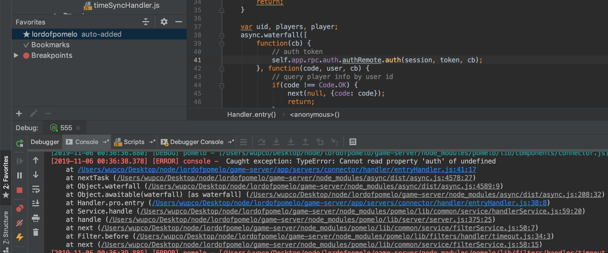

# pomelo External Control of Critical State Data

## Detail 

pomelo is a scalable game server framework for Node.js. The vulnerability locates at f `template/game-server/app/servers/connector/handler/entryHandler.js`.  This module is for handling user login. However, it is found that certain internal attributes can be overwritten via a conflicting name from user-input. Hence, a malicious attacker can luanch attacks by adding additional attributes to user-input.

```
var Handler = function(app) {
	this.app = app;

	if(!this.app)
		logger.error(app);
};

```

## PoC

We use the [official demo](https://github.com/NetEase/lordofpomelo) of pomelo to demonstrate the attack.

1. Visit the demo, and open browser console to send payload by the following command


```
pomelo.request('connector.entryHandler.constructor', { get:{} }

```
2. The get method which is originally for processing login request will be overwritten by an empty object, so all users will not be able to log into the game.

3. Error occurs when any user try to log into the game server.


